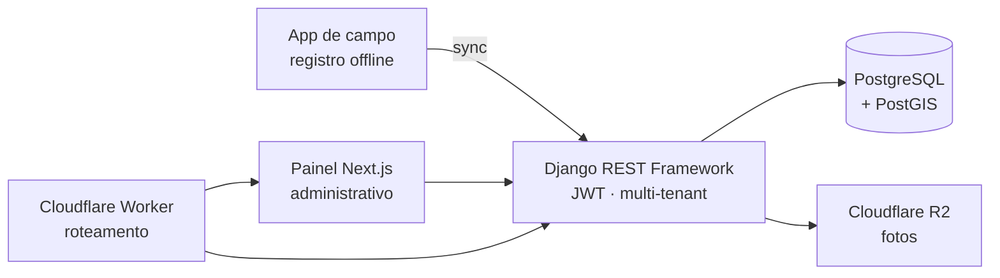

<h1 align="center">Victor Lohan</h1>

  <strong>Desenvolvedor Backend</strong> — Java · Quarkus · Spring Boot · Python · Django 
  Sistemas com API REST, banco relacional, testes automatizados e CI/CD.

  
  
  
  

---

### Sobre mim

- Cursando **Engenharia de Software** no Instituto Federal de Goiás (IFG).
- Backend em **Java (Quarkus, Spring Boot)** e **Python (Django REST, FastAPI)**, sobre **PostgreSQL** e **MongoDB**.
- Venho de **QA**: passei pela Compass UOL construindo automação de testes, e isso mudou como eu escrevo código — teste, cobertura e pipeline entram junto com a feature, não depois.
- **AWS Certified Cloud Practitioner (CLF-C02)**.

---

### Tecnologias

  

  

---

### Projetos

Boa parte do meu trabalho está em repositório privado (TCC com cliente real e produtos ainda não lançados). Descrevo abaixo o que construí, a stack e os números — o código dos públicos está linkado.

 

#### Pescra — Monitoramento de Pesca para Turismo de Base Comunitária
`repositório privado` · `TCC + cliente real` · `em desenvolvimento`

Plataforma para guias indígenas e ribeirinhos registrarem capturas **offline**, gerando dados científicos para órgãos reguladores (IBAMA/FUNAI).

- **80 dos 140 commits** do repositório são meus, em time de 5 pessoas, com fluxo de Pull Request e code review.
- **Isolamento multi-tenant** implementado por mixins e coberto por teste.
- **Sincronização offline** — o app de campo funciona sem rede e reconcilia depois.
- **Catraca de cobertura no CI**: `pytest --cov-fail-under`, elevada de 75% para 79%.

**Stack:** Django 5.2 · Django REST Framework · SimpleJWT · PostgreSQL + PostGIS · Cloudflare R2 (S3-compatible) · Next.js 16 · Docker · pytest · drf-spectacular

 

#### InDexa — Geração automatizada de laudos técnicos
`repositório privado` · `em desenvolvimento`

Reescrita completa de um sistema anterior meu ([auto-laudo](https://github.com/vicloh/auto-laudo), público), trocando a arquitetura por decisão técnica: saiu MongoDB/GridFS, entrou **PostgreSQL com Panache**; a geração de PDF saiu do código e virou um **serviço dedicado com Gotenberg**.

- Backend **Quarkus** com REST Client para integrações externas e OpenAPI.
- Separação de **teste unitário e de integração** no build (Surefire / Failsafe).
- Frontend **React + TypeScript + Tailwind** (Vite).

**Stack:** Java 21 · Quarkus · Hibernate ORM Panache · PostgreSQL · Gotenberg · React · TypeScript · Tailwind · Docker

 

#### Sistema de gestão para barbearias
`repositório privado` · `em desenvolvimento`

Projeto em dupla onde eu fui responsável pela **esteira de qualidade**: escrevi o pipeline de **CI/CD em GitHub Actions** e a **suíte de testes de integração** do backend, e atuo revisando e integrando os Pull Requests.

**Stack:** Java 21 · Quarkus · Panache · PostgreSQL · Flyway (migrations versionadas) · JUnit 5 · Mockito · Testcontainers · JaCoCo · REST Assured · Next.js · Docker Compose

 

#### AvaliaAI — Correção automatizada de cartões-resposta
`repositório privado` · `em dupla` · `cliente real`

Sistema que gera, lê e corrige cartões-resposta escolares. Arquitetura de três serviços integrados por API REST, com pipeline de **OMR** (Optical Mark Recognition) em visão computacional.

**Stack:** Quarkus · Panache · PostgreSQL · JWT · Next.js · React · TypeScript · FastAPI · OpenCV · Docker Compose · Cloudflare Email Worker

---

### Repositórios públicos

| Projeto | O que é | Stack |
|---|---|---|
| [auto-laudo](https://github.com/vicloh/auto-laudo) | API REST de laudos técnicos em PDF, com deploy no Railway e integração com a BrasilAPI | Java 21 · Quarkus · MongoDB · GridFS · Docker |
| [challenge-final-PB-CompassUol](https://github.com/vicloh/challenge-final-PB-CompassUol) | Suíte E2E de **92 testes** — 100% dos endpoints e 100% das User Stories cobertos, 92% de sucesso | Robot Framework · Playwright · Python |
| [Classificador-de-Email](https://github.com/vicloh/Classificador-de-Email) | Classificação automática de e-mails com IA generativa e geração de resposta | Python · FastAPI · Google Gemini |
| [terminalJava](https://github.com/vicloh/terminalJava) | Simulador de terminal Linux — exercício de POO | Java |
| [teste-tecnico-java](https://github.com/vicloh/teste-tecnico-java) | Desafio técnico para vaga de estágio | Java |
| [Faculdade-Engenharia-De-Software](https://github.com/vicloh/Faculdade-Engenharia-De-Software) | Exercícios da graduação — beecrowd e calculadora algébrica | C |

---

### GitHub

  
  

