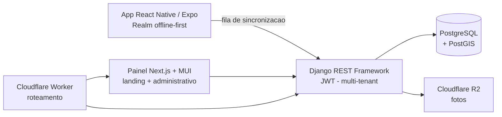
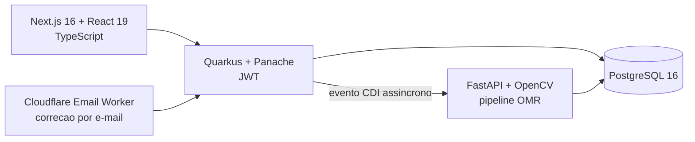
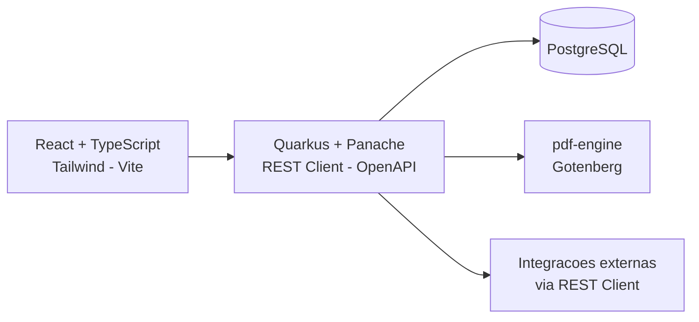
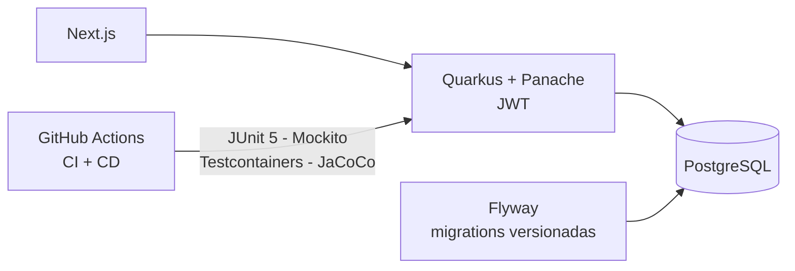

<h1 align="center">Victor Lohan</h1>

  <strong>Desenvolvedor Full Stack</strong> 
  React · Next.js · TypeScript · React Native &nbsp;|&nbsp; Java · Quarkus · Spring Boot · Python · Django 
  Do componente ao banco: eu desenho a tela, a API e o schema do mesmo sistema.

  
  
  

---

### Sobre mim

- Cursando **Engenharia de Software** no Instituto Federal de Goiás (IFG).
- **Full stack**: construo a interface em **React / Next.js / TypeScript** e a API em **Java (Quarkus, Spring Boot)** ou **Python (Django REST, FastAPI)**, sobre **PostgreSQL**. Também levo para o mobile com **React Native / Expo**.
- Venho de **QA** — passei pela Compass UOL construindo automação de testes, e isso mudou como eu escrevo código: teste, cobertura e pipeline entram junto com a feature, não depois.
- **AWS Certified Cloud Practitioner (CLF-C02)**.

---

### Tecnologias

<em>Frontend e mobile</em>

  

<em>Backend e dados</em>

  
   
  
  
  
  

<em>Cloud, DevOps e qualidade</em>

  
   
  
  
  
  
  
  

---

### Projetos

Boa parte do meu trabalho está em repositório privado — TCC com cliente real e produtos ainda não lançados. Abaixo está o que construí, a arquitetura e os números. Os públicos estão linkados no fim.

 

#### Pescra — Monitoramento de Pesca para Turismo de Base Comunitária
`privado` · `TCC + cliente real` · `em desenvolvimento`

Plataforma para guias indígenas e ribeirinhos registrarem capturas **em campo, sem internet**, gerando dados científicos para órgãos reguladores (IBAMA/FUNAI). O app guarda tudo localmente e reconcilia com o servidor quando a rede volta.

- Time de 5 pessoas, fluxo de **Pull Request com code review** — sou um dos revisores.
- **Isolamento multi-tenant** por mixins, coberto por teste.
- **Catraca de cobertura no CI** (`pytest --cov-fail-under`), elevada de 75% para 79%.
- Minha atuação principal é a **API e o painel web**; participei também de features do app mobile.

**Stack:** Django 5.2 · Django REST Framework · SimpleJWT · PostgreSQL + PostGIS · Cloudflare R2 · Next.js 16 · MUI · React Native · Expo · Realm · pytest · Docker

 

#### AvaliaAI — Correção automatizada de cartões-resposta
`privado` · `em dupla` · `cliente real`

Gera, lê e corrige cartões-resposta escolares. O professor sobe a folha — ou manda por e-mail — e recebe a correção. A leitura é **visão computacional (OMR)**: alinhamento por marcadores fiduciais, QR Code por aluno, detecção de bolhas por contorno.

- No front: estado de autenticação global via **Context API** e **refresh automático de token** por interceptor Axios.
- No back: **processamento assíncrono** por eventos CDI e migrations SQL idempotentes.
- Projeto planejado e construído **em dupla**, os dois na mesma tela.

**Stack:** Java 21 · Quarkus · Panache · PostgreSQL 16 · JWT · Next.js 16 · React 19 · TypeScript · FastAPI · OpenCV · Docker Compose

 

#### InDexa — Geração automatizada de laudos técnicos
`privado` · `em desenvolvimento`

Reescrita completa de um sistema anterior meu ([auto-laudo](https://github.com/vicloh/auto-laudo), público), com duas decisões de arquitetura: saiu MongoDB/GridFS e entrou **PostgreSQL com Panache**; a geração de PDF saiu de dentro do código e virou **serviço dedicado com Gotenberg**.

- Separação de **teste unitário e de integração** no build (Surefire / Failsafe).
- Documentação de API gerada por **OpenAPI**.

**Stack:** Java 21 · Quarkus · Panache · PostgreSQL · Gotenberg · React · TypeScript · Tailwind · Vite · Docker

 

#### Sistema de gestão para barbearias
`privado` · `em dupla` · `em desenvolvimento`

Projeto onde fui responsável pela **esteira de qualidade**: escrevi o pipeline de **CI/CD em GitHub Actions** e a **suíte de testes de integração** do backend, e atuo revisando e integrando os Pull Requests.

**Stack:** Java 21 · Quarkus · Panache · PostgreSQL · Flyway · JUnit 5 · Mockito · Testcontainers · JaCoCo · REST Assured · Next.js · Docker Compose

---

### Repositórios públicos

| Projeto | O que é | Stack |
|---|---|---|
| [auto-laudo](https://github.com/vicloh/auto-laudo) | API REST de laudos técnicos em PDF, deploy no Railway, integração com a BrasilAPI | Java 21 · Quarkus · MongoDB · GridFS · Docker |
| [challenge-final-PB-CompassUol](https://github.com/vicloh/challenge-final-PB-CompassUol) | Suíte E2E de **92 testes** — 100% dos endpoints e 100% das User Stories, 92% de sucesso | Robot Framework · Playwright · Python |
| [Classificador-de-Email](https://github.com/vicloh/Classificador-de-Email) | Classificação automática de e-mails com IA generativa e geração de resposta | Python · FastAPI · Google Gemini |
| [terminalJava](https://github.com/vicloh/terminalJava) | Simulador de terminal Linux — exercício de POO | Java |
| [teste-tecnico-java](https://github.com/vicloh/teste-tecnico-java) | Desafio técnico para vaga de estágio | Java |
| [Faculdade-Engenharia-De-Software](https://github.com/vicloh/Faculdade-Engenharia-De-Software) | Exercícios da graduação — beecrowd e calculadora algébrica | C |
